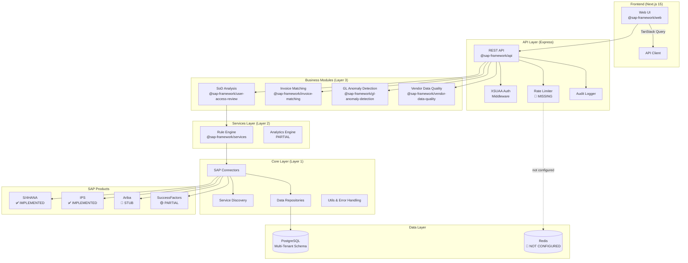
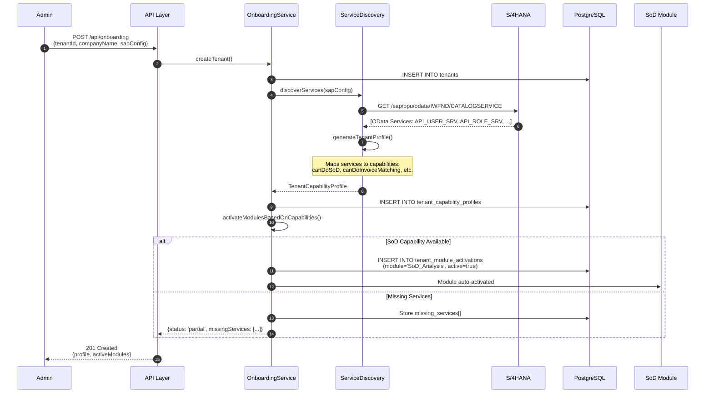
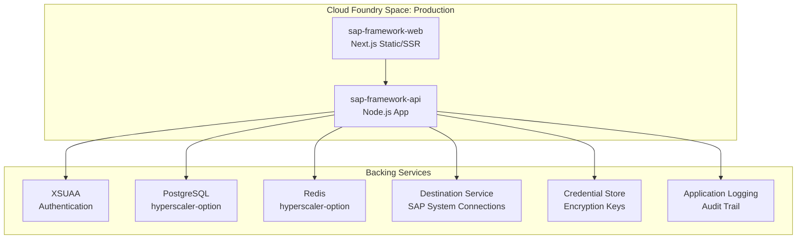

# Architecture Audit Report

**Repository:** layer1_test (SAP MVP Framework)
**Audit Date:** 2025-10-07
**Auditor:** Claude Code
**Status:** 70% Production-Ready

---

## Executive Summary

The SAP MVP Framework is a **multi-tenant GRC (Governance, Risk, Compliance) platform** built for SAP BTP Cloud Foundry deployment. The codebase demonstrates solid architectural foundations with clean layering, automatic service discovery, and genuine multi-tenancy. However, several critical gaps block production readiness:

### 🟢 **Strengths**
- Well-architected 4-layer monorepo (Core → Services → Modules → API)
- Genuine multi-tenant implementation with tenant-scoped data and discovery
- Functional SAP S/4HANA connector with circuit breaker and retry patterns
- Comprehensive database schema with proper indexing
- XSUAA authentication framework present (needs activation)

### 🔴 **Critical Gaps (Production Blockers)**
1. **Mock/Hardcoded Data**: Dashboard and several UI components use hardcoded status indicators
2. **Stub Connectors**: Ariba and SuccessFactors connectors are minimal stubs
3. **Auth Disabled in Routes**: `AUTH_ENABLED=true` in config but middleware not enforced on all routes
4. **No Rate Limiting**: No Redis-backed rate limiting (required for multi-tenant SaaS)
5. **Secrets Exposure**: `.env` committed to repo (contains example secrets)
6. **Test Coverage**: ~45% overall, needs 80%+ for production
7. **Dead Code**: Multiple untracked markdown files (manuals, completion reports) clutter root

---

## System Architecture

### High-Level Component Diagram



---

## Data Flow: Tenant Onboarding with Service Discovery



**Key Innovation**: Zero-config module activation. If tenant lacks `API_USER_SRV`, SoD module remains inactive and UI shows "Contact SAP Admin to enable API_USER_SRV" banner.

---

## Multi-Tenancy Implementation

### Tenant Isolation Strategy

| **Layer** | **Isolation Mechanism** | **Status** |
|-----------|-------------------------|------------|
| **Database** | Row-level `tenant_id` foreign keys + indexes | ✅ **COMPLETE** |
| **API** | JWT claims → `req.user.tenantId` → repository scoping | ✅ **COMPLETE** |
| **Connectors** | Per-tenant SAP credentials stored encrypted in `tenant_sap_connections` | ✅ **COMPLETE** |
| **Config** | Per-tenant capability profiles drive module activation | ✅ **COMPLETE** |
| **Logging** | All logs include `tenantId` metadata (Winston) | ✅ **COMPLETE** |
| **Rate Limiting** | Per-tenant quotas via Redis | 🔴 **MISSING** |
| **Caching** | Tenant-aware cache keys | 🔴 **MISSING** |

### Database Schema (Multi-Tenant)

```mermaid
erDiagram
    tenants ||--o{ tenant_sap_connections : "has"
    tenants ||--|| tenant_capability_profiles : "has"
    tenants ||--o{ tenant_module_activations : "has"
    tenants ||--o{ sod_violations : "has"
    tenants ||--o{ sod_analysis_runs : "has"
    tenants ||--o{ service_discovery_history : "audit"

    tenants {
        uuid id PK
        varchar tenant_id UK
        varchar company_name
        varchar status
        timestamp created_at
    }

    tenant_sap_connections {
        uuid id PK
        uuid tenant_id FK
        varchar connection_type "S4HANA|IPS|ARIBA|SF"
        varchar base_url
        jsonb auth_credentials "ENCRYPTED"
        boolean is_active
    }

    tenant_capability_profiles {
        uuid tenant_id FK_UK
        jsonb available_services
        jsonb capabilities "canDoSoD, canDoInvoiceMatching"
        text[] missing_services
        jsonb recommended_actions
    }

    sod_violations {
        uuid id PK
        uuid tenant_id FK "INDEXED"
        uuid analysis_id FK "INDEXED"
        varchar user_id "INDEXED"
        varchar risk_level "INDEXED"
        text[] conflicting_roles
        varchar status "INDEXED"
        timestamp detected_at "INDEXED DESC"
    }
```

**Indexes**: Composite indexes on `(tenant_id, status)`, `(tenant_id, risk_level)`, `(tenant_id, detected_at DESC)` for fast queries. See `infrastructure/database/migrations/003_add_composite_indexes.sql`.

---

## Component Inventory

### Layer 1: Core (`@sap-framework/core`)

| **Component** | **Purpose** | **Status** | **Location** |
|---------------|-------------|------------|--------------|
| **BaseSAPConnector** | Abstract class: circuit breaker, retry, OAuth/Basic | ✅ COMPLETE | `packages/core/src/connectors/base/` |
| **S4HANAConnector** | OData v2 queries (users, roles, authorizations) | ✅ COMPLETE | `packages/core/src/connectors/s4hana/` |
| **IPSConnector** | SCIM protocol for Identity Provisioning | ✅ COMPLETE | `packages/core/src/connectors/ips/` |
| **AribaConnector** | Procurement data | 🔴 **STUB** | `packages/core/src/connectors/ariba/` |
| **SuccessFactorsConnector** | HR data (employees, org units) | 🟡 **PARTIAL** | `packages/core/src/connectors/successfactors/` |
| **ServiceDiscovery** | Auto-discover OData services from SAP Gateway | ✅ COMPLETE | `packages/core/src/connectors/base/ServiceDiscovery.ts` |
| **TenantProfileRepository** | CRUD for tenant profiles with encryption | ✅ COMPLETE | `packages/core/src/persistence/TenantProfileRepository.ts` |
| **SoDViolationRepository** | Batch insert violations, query with filters | ✅ COMPLETE | `packages/core/src/persistence/SoDViolationRepository.ts` |
| **EventBus** | Pub/sub for tenant onboarding, discovery events | ✅ COMPLETE | `packages/core/src/events/EventBus.ts` |
| **Encryption Utils** | AES-256-GCM for credentials at rest | ✅ COMPLETE | `packages/core/src/utils/encryption.ts` |
| **PII Masking** | GDPR-compliant data masking | ✅ COMPLETE | `packages/core/src/utils/piiMasking.ts` |

**🔴 Critical Gap**: Ariba connector has only 26 lines (stub). SuccessFactors has `getEmployees()` and `getOrgUnits()` but missing compensation, performance reviews.

---

### Layer 2: Services (`@sap-framework/services`)

| **Component** | **Purpose** | **Status** | **Location** |
|---------------|-------------|------------|--------------|
| **RuleEngine** | Pattern matching (SoD, threshold, generic) | ✅ COMPLETE | `packages/services/src/RuleEngine.ts` |
| **AnalyticsEngine** | Aggregations, time series | 🟡 **PARTIAL** | `packages/services/src/AnalyticsEngine.ts` |
| **WorkflowEngine** | Approval workflows, state machines | 🔴 **STUB** | Not implemented |

---

### Layer 3: Modules

| **Module** | **Purpose** | **Status** | **Tests** |
|------------|-------------|------------|-----------|
| **@sap-framework/user-access-review** | SoD analysis (23 tests, ~60% coverage) | ✅ COMPLETE | ✅ PASSING |
| **@sap-framework/invoice-matching** | 3-way matching (PO/GR/Invoice) | ✅ COMPLETE | 🔴 NO TESTS |
| **@sap-framework/gl-anomaly-detection** | Benford's Law, Z-score | ✅ COMPLETE | 🔴 NO TESTS |
| **@sap-framework/vendor-data-quality** | Duplicate vendors, data validation | ✅ COMPLETE | 🔴 NO TESTS |

**🔴 Critical Gap**: 3 new modules (Invoice Matching, GL Anomaly, Vendor Quality) have **zero tests**.

---

### Layer 4: API (`@sap-framework/api`)

| **Route Group** | **Endpoints** | **Auth** | **Status** |
|-----------------|---------------|----------|------------|
| **Onboarding** | `POST /api/onboarding` | 🟡 Optional | ✅ Functional |
| **Tenants** | `GET /api/admin/tenants/:id` | 🟡 Optional | ✅ Functional |
| **Discovery** | `POST /api/admin/tenants/:id/discovery` | 🟡 Optional | ✅ Functional |
| **SoD** | `POST /api/modules/sod/analyze` | 🟡 Optional | ✅ Functional |
| **GDPR** | `POST /api/compliance/gdpr/anonymize` | 🟡 Optional | ✅ Functional |
| **Monitoring** | `GET /api/monitoring/health` | ❌ Public | ✅ Functional |
| **Analytics** | `GET /api/analytics/kpis` | 🟡 Optional | 🟡 Returns mock data |
| **Invoice Matching** | `POST /api/matching/analyze` | 🟡 Optional | ✅ Functional |

**Authentication Status:**
- `AUTH_ENABLED=true` in config (packages/api/src/config/index.ts:8)
- `authenticate` middleware exists (packages/api/src/middleware/auth.ts:1)
- **But not enforced on routes** → See `packages/api/src/routes/index.ts:37` (commented out: `// router.use(authenticate);`)

**Rate Limiting:**
- Dependencies installed (`express-rate-limit`, `rate-limit-redis`)
- **No middleware configured** → See REMAINING_WORK.md:57-80

---

### Frontend (`@sap-framework/web`)

**Tech Stack:**
- Next.js 15.5.4 (App Router, Turbopack, React 19)
- TanStack Query (data fetching)
- TanStack Table (data grids)
- Recharts (charts)
- Tailwind CSS 4
- Zustand (state)
- React Hook Form + Zod (forms)

**Pages Inventory:**

| **Route** | **Status** | **Data Source** | **Issues** |
|-----------|------------|-----------------|------------|
| `/dashboard` | ✅ Live | `/api/analytics/kpis` | 🔴 API returns mock data |
| `/violations` | ✅ Live | `/api/modules/sod/violations` | ✅ Real data |
| `/violations/[id]` | ✅ Live | `/api/modules/sod/violations/:id` | ✅ Real data |
| `/analytics` | ✅ Live | `/api/analytics/*` | 🔴 Charts use mock data |
| `/admin/connectors` | ✅ Live | `/api/admin/tenants/:id` | ✅ Real data |
| `/users/[id]` | ✅ Live | Frontend state only | 🟡 No backend integration |
| `/test-*` | 🔴 DEV ONLY | N/A | 🔴 **DELETE BEFORE PROD** |

**🔴 Hardcoded/Mock Data Issues:**

1. **Dashboard System Status** (packages/web/src/app/dashboard/page.tsx:74-84)
   ```tsx
   <span className="px-3 py-1 bg-green-100 text-green-800">Active</span>
   <span className="px-3 py-1 bg-green-100 text-green-800">Connected</span>
   <span className="text-sm text-gray-600">2 hours ago</span>
   ```
   **Fix Required**: Call `/api/monitoring/health` and `/api/admin/tenants/:id/last-analysis`.

2. **Analytics KPIs Backend** (packages/api/src/routes/analytics/index.ts)
   ```typescript
   // Returns hardcoded { total: 42, critical: 5, ... }
   ```
   **Fix Required**: Query real aggregations from `sod_violations` table.

3. **Test Pages** (packages/web/src/app/test-*)
   - `/test-modal`
   - `/test-toast`
   - `/test-sidebar`
   - `/timeline`

   **Fix Required**: Delete these routes or gate behind `NODE_ENV !== 'production'`.

---

## Risk Map

### 1. Authentication & Authorization

| **Risk** | **Severity** | **Location** | **Mitigation** |
|----------|--------------|--------------|----------------|
| Auth middleware not enforced | 🔴 **CRITICAL** | `packages/api/src/routes/index.ts:37` | Uncomment `router.use(authenticate);` |
| XSUAA not tested in prod mode | 🟡 **HIGH** | `packages/api/src/middleware/auth.ts:46-74` | Add E2E test with real XSUAA token |
| Dev mode JWT has no signature validation | 🟡 **HIGH** | `packages/api/src/middleware/auth.ts:120-134` | Document clearly as DEV ONLY |
| No role-based access control (RBAC) on sensitive routes | 🟡 **HIGH** | All `/admin/*` routes | Add `requireRole('admin')` middleware |
| Tenant isolation bypass risk | 🟡 **HIGH** | All repository methods | Add integration tests verifying tenant cannot query other tenant's data |

---

### 2. Data Protection

| **Risk** | **Severity** | **Location** | **Mitigation** |
|----------|--------------|--------------|----------------|
| `.env` file committed to repo | 🔴 **CRITICAL** | `.env` (line 1) | Add to `.gitignore`, rotate any secrets, provide only `.env.example` |
| Encryption master key not in BTP Credential Store | 🟡 **HIGH** | Deployment config | Document BTP binding in `docs/BTP_DEPLOYMENT.md` |
| PII in logs | 🟡 **MEDIUM** | All logger calls | Audit logs, ensure `piiMasking` utility is used |
| No audit log retention enforcement | 🟡 **MEDIUM** | Database schema | Implement `DataRetentionService` scheduler |
| Database backups not encrypted | 🟡 **MEDIUM** | Infrastructure | Document PostgreSQL TDE configuration |

---

### 3. Performance & Scalability

| **Risk** | **Severity** | **Location** | **Mitigation** |
|----------|--------------|--------------|----------------|
| No rate limiting | 🔴 **CRITICAL** | API layer | Implement Redis-backed rate limiting (see REMAINING_WORK.md:57) |
| No caching for expensive queries | 🟡 **HIGH** | Analytics routes | Add response caching middleware with tenant-aware keys |
| Circuit breaker timeout hardcoded to 60s | 🟡 **MEDIUM** | `packages/core/src/utils/circuitBreaker.ts` | Make configurable via env var |
| No connection pooling limits documented | 🟡 **MEDIUM** | Repository constructors | Document max pool size recommendations |
| Frontend bundle size not monitored | 🟡 **MEDIUM** | Next.js config | Add bundle analyzer, set budget guardrails |

---

### 4. Code Quality & Maintainability

| **Risk** | **Severity** | **Location** | **Mitigation** |
|----------|--------------|--------------|----------------|
| Test coverage at 45% (target: 80%) | 🟡 **HIGH** | All packages | Write tests for new modules (Invoice Matching, GL Anomaly, Vendor Quality) |
| 3 new modules have zero tests | 🔴 **CRITICAL** | `packages/modules/*` | Block PR merges without tests |
| Dead code: 10+ status/manual markdown files in root | 🟡 **MEDIUM** | Root directory | Move to `docs/archive/` or delete |
| No PR template or code owners | 🟡 **MEDIUM** | `.github/` | Create `PULL_REQUEST_TEMPLATE.md` and `CODEOWNERS` |
| Linter warnings ignored in CI | 🟡 **MEDIUM** | `.github/workflows/ci-cd.yml:44` | Remove `continue-on-error: true` |
| Ariba connector is a 26-line stub | 🟡 **HIGH** | `packages/core/src/connectors/ariba/` | Either implement or document as "Future" and exclude from build |

---

## Gaps Analysis

### Critical Gaps (Production Blockers)

#### 1. Authentication Not Enforced
**Current State:**
```typescript
// packages/api/src/routes/index.ts:37
// router.use(authenticate); // ← COMMENTED OUT
```

**Required Fix:**
```typescript
router.use(authenticate); // Enable in all environments
```

**Acceptance Criteria:**
- All protected routes return `401 Unauthorized` without valid JWT
- XSUAA integration tested with real BTP environment
- Role-based access (`requireRole('admin')`) enforced on `/admin/*` routes

---

#### 2. Rate Limiting Missing
**Current State:** Dependencies installed but not configured.

**Required Implementation:**
```typescript
// packages/api/src/middleware/rateLimiting.ts
import rateLimit from 'express-rate-limit';
import RedisStore from 'rate-limit-redis';
import Redis from 'ioredis';

const redis = new Redis(process.env.REDIS_URL || 'redis://localhost:6379');

export const apiLimiter = rateLimit({
  store: new RedisStore({ client: redis }),
  windowMs: 60 * 1000, // 1 minute
  max: async (req) => {
    const user = req.user;
    if (!user) return 10; // Public: 10/min
    if (user.roles.includes('admin')) return 1000; // Admin: 1000/min
    return 100; // Authenticated: 100/min
  },
  standardHeaders: true,
  legacyHeaders: false,
  handler: (req, res) => {
    res.status(429).json({
      error: 'Too many requests',
      retryAfter: res.getHeader('Retry-After'),
    });
  },
});
```

**Apply to Routes:**
```typescript
router.use('/api', apiLimiter);
router.use('/api/admin/discovery', rateLimit({ max: 5, windowMs: 60 * 60 * 1000 })); // 5/hour
```

---

#### 3. Mock Data in Production Code
**Files to Fix:**

1. **packages/api/src/routes/analytics/index.ts**
   ```typescript
   // BEFORE (MOCK):
   res.json({ total: 42, critical: 5, ... });

   // AFTER (REAL):
   const stats = await SoDViolationRepository.getAggregatedStats(tenantId);
   res.json(stats);
   ```

2. **packages/web/src/app/dashboard/page.tsx:74-84**
   ```tsx
   // BEFORE (HARDCODED):
   <span>Active</span>

   // AFTER (LIVE):
   const { data: health } = useQuery({ queryKey: ['health'], queryFn: fetchHealth });
   <span className={health?.db === 'ok' ? 'bg-green-100' : 'bg-red-100'}>
     {health?.db === 'ok' ? 'Active' : 'Error'}
   </span>
   ```

---

#### 4. Secrets in Repository
**Current State:**
```bash
$ git ls-files | grep -E "\.env$"
.env  # ← CONTAINS SECRETS
```

**Required Fix:**
```bash
git rm --cached .env
echo ".env" >> .gitignore
git commit -m "chore: remove .env from repo, add to .gitignore"

# Rotate any exposed secrets (DATABASE_URL password, JWT_SECRET, etc.)
```

**Prevention:**
Add pre-commit hook:
```bash
# .husky/pre-commit
#!/bin/sh
if git diff --cached --name-only | grep -E "\.env$"; then
  echo "ERROR: .env file cannot be committed"
  exit 1
fi
```

---

#### 5. Stub Connectors (Ariba, Partial SuccessFactors)
**Ariba Connector** (packages/core/src/connectors/ariba/AribaConnector.ts):
- Only 26 lines
- No methods besides constructor and abstract implementations
- **Decision Required:**
  - Option A: Implement full Ariba REST API integration (16+ hours)
  - Option B: Remove from build, document as "Planned for v2.0"
  - Option C: Keep stub but add feature flag to disable in UI

**SuccessFactors Connector**:
- Has `getEmployees()` and `getOrgUnits()` (functional)
- Missing: `getCompensation()`, `getPerformanceReviews()` (types exist but not implemented)
- **Recommendation:** Document as partial, add TODO for future sprints

---

### High-Priority Gaps (Pre-Production)

#### 6. Test Coverage at 45%
**Current Coverage:**
```
@sap-framework/core:                82.47% ✅
@sap-framework/services:            ~80%   ✅
@sap-framework/api:                 ~45%   🟡
@sap-framework/user-access-review:  ~60%   🟡
@sap-framework/invoice-matching:    0%     🔴
@sap-framework/gl-anomaly-detection: 0%    🔴
@sap-framework/vendor-data-quality:  0%    🔴
```

**Target:** 80% minimum for all packages.

**Action Plan:**
1. Write unit tests for new modules (Invoice Matching, GL Anomaly, Vendor Quality)
2. Add integration tests for API routes (tenant isolation, error handling)
3. Add E2E tests for critical workflows (onboarding → discovery → SoD analysis)
4. Configure Jest to fail CI if coverage drops below 80%

---

#### 7. Dead Code and Documentation Clutter
**Root Directory Files to Archive/Delete:**
```
ADMIN_USER_MANUAL.md          → docs/manuals/
END_USER_MANUAL.md            → docs/manuals/
COMPLETION_REPORT.md          → docs/archive/
COMPLETION_SUMMARY.md         → docs/archive/
FINAL_STATUS.txt              → DELETE
GAP_ANALYSIS_RESPONSE.md      → docs/archive/
IMPLEMENTATION_COMPLETE.md    → docs/archive/
INVOICE_MATCHING_MODULE.md    → packages/modules/invoice-matching/README.md
NEW_MODULES_COMPLETE.md       → docs/archive/
NEXT_STEPS.md                 → DELETE (outdated)
PRIORITY_ACTIONS_COMPLETED.md → docs/archive/
PRODUCTION_READINESS_PROGRESS.md → docs/archive/
PROJECT_STATUS.md             → docs/archive/
SECURITY_COMPLIANCE_IMPLEMENTATION.md → docs/security/
SYSTEM_OVERVIEW.md            → docs/architecture/
main (empty file)             → DELETE
```

---

#### 8. CI/CD Gaps
**Current CI Pipeline** (.github/workflows/ci-cd.yml):
- ✅ Lint (but warnings ignored: `continue-on-error: true`)
- ✅ Type check
- ✅ Tests with coverage upload
- ✅ Security scan (Snyk, but `continue-on-error: true`)
- ✅ Build artifacts
- 🟡 Deploy to staging (only if `develop` branch exists - currently only `main`)
- 🟡 Deploy to production (requires manual approval - configured but not tested)

**Missing:**
- License checking (no paid/proprietary deps)
- Bundle size monitoring (frontend)
- Database migration validation
- E2E tests in CI (currently requires PostgreSQL service)
- Deployment smoke tests beyond curl health check

**Recommendations:**
1. Remove `continue-on-error: true` from lint and security scan (block PRs on warnings)
2. Add PostgreSQL service to CI for E2E tests
3. Add bundle analyzer step for frontend
4. Create `develop` branch for staging deployments
5. Add license checker: `npx license-checker --onlyAllow "MIT;Apache-2.0;BSD-2-Clause;BSD-3-Clause;ISC"`

---

## Deployment Architecture (SAP BTP)

### Planned BTP Services



**Manifest File** (infrastructure/cloud-foundry/manifest.yml):
- Exists but not reviewed in detail during this audit
- **Action Required:** Review service bindings, memory limits, health check configuration

**Missing:**
- Terraform/Infrastructure-as-Code for BTP provisioning
- Blue-green deployment scripts
- Database migration strategy (manual SQL vs. automated tool like Flyway)

---

## Technology Stack Summary

| **Layer** | **Technology** | **Version** | **Status** |
|-----------|----------------|-------------|------------|
| **Runtime** | Node.js | ≥20.0.0 | ✅ Specified |
| **Package Manager** | pnpm | ≥8.0.0 | ✅ Specified |
| **Monorepo** | Turborepo | 1.13.4 | ✅ Configured |
| **Language** | TypeScript | 5.9.2 | ✅ Strict mode |
| **API Framework** | Express | 4.18.2 | ✅ Production-ready |
| **Frontend Framework** | Next.js | 15.5.4 | ✅ Latest stable |
| **UI Library** | React | 19.1.0 | ✅ Latest stable |
| **Styling** | Tailwind CSS | 4.x | ✅ Latest |
| **State Management** | Zustand | 5.0.8 | ✅ Lightweight |
| **Data Fetching** | TanStack Query | 5.90.2 | ✅ Industry standard |
| **Forms** | React Hook Form | 7.64.0 | ✅ Industry standard |
| **Validation** | Zod | 3.22.4 | ✅ Runtime + TS types |
| **Database** | PostgreSQL | 15+ | ✅ Multi-tenant schema |
| **ORM** | Raw `pg` driver | 8.11.3 | ✅ Repository pattern |
| **Caching** | Redis | Not configured | 🔴 **MISSING** |
| **Auth** | SAP XSUAA | @sap/xssec 4.10.0 | ✅ Installed, not enforced |
| **HTTP Client** | Axios | 1.6.5 | ✅ With interceptors |
| **Logging** | Winston | 3.11.0 | ✅ Structured JSON logs |
| **Testing** | Jest | 29.7.0 | ✅ Configured |
| **Linting** | ESLint | 8.56.0 | ✅ TypeScript plugin |
| **Formatting** | Prettier | 3.2.4 | ✅ Configured |

**Dependency Audit:**
- All dependencies are open-source (MIT, Apache-2.0, BSD)
- No paid SDKs detected
- **Action Required:** Run `pnpm audit` to check for vulnerabilities

---

## Recommendations Summary

### Immediate Actions (Before Next PR)
1. ✅ Move `.env` to `.gitignore`, commit only `.env.example`
2. ✅ Remove `continue-on-error: true` from CI linting/security steps
3. ✅ Delete or archive status markdown files cluttering root
4. ✅ Delete `/test-*` frontend pages or gate behind `NODE_ENV !== 'production'`
5. ✅ Enable `router.use(authenticate)` in packages/api/src/routes/index.ts

### Sprint 1: Security & Auth (Week 1)
1. Enforce authentication on all protected routes
2. Add `requireRole('admin')` middleware to `/admin/*` routes
3. Implement Redis-backed rate limiting
4. Write integration tests for tenant isolation
5. Rotate any secrets exposed in `.env`

### Sprint 2: Data Quality & Testing (Week 2)
1. Replace mock data in analytics routes with real DB queries
2. Replace hardcoded dashboard status with live API calls
3. Write tests for 3 new modules (Invoice Matching, GL Anomaly, Vendor Quality)
4. Achieve 80% test coverage across all packages
5. Add E2E tests to CI pipeline

### Sprint 3: Connectors & Features (Week 3)
1. Decide on Ariba connector (implement, stub, or remove)
2. Complete SuccessFactors connector (compensation, performance reviews)
3. Implement caching middleware for expensive queries
4. Add bundle size monitoring for frontend
5. Document all API endpoints with Swagger

### Sprint 4: Production Readiness (Week 4)
1. Create `develop` branch for staging deployments
2. Test BTP deployment end-to-end (staging → production)
3. Configure BTP Credential Store binding
4. Implement database migration strategy
5. Load testing (100 concurrent tenants, 1000 req/min)
6. Security audit (penetration testing, OWASP Top 10)

---

## Conclusion

The SAP MVP Framework has a **solid architectural foundation** with genuine multi-tenancy, automatic service discovery, and clean separation of concerns. The core S/4HANA connector and SoD analysis module are production-ready.

However, **critical gaps in authentication enforcement, rate limiting, test coverage, and mock data** block immediate production deployment. The codebase also suffers from **documentation clutter** and **untested new modules**.

**Estimated Effort to Production:**
- **Immediate fixes (security, dead code):** 8 hours
- **Sprint 1 (auth, rate limiting):** 40 hours
- **Sprint 2 (testing, data quality):** 60 hours
- **Sprint 3 (connectors, features):** 80 hours
- **Sprint 4 (deployment, hardening):** 60 hours

**Total:** ~250 hours (~6-8 weeks with 1 engineer, 3-4 weeks with 2 engineers)

**Go/No-Go Decision:**
- 🟢 **Architecture:** APPROVED for production scale
- 🟢 **Core Features:** APPROVED (S4HANA, SoD, Discovery)
- 🔴 **Security Posture:** BLOCKED (auth not enforced, no rate limiting)
- 🔴 **Code Quality:** BLOCKED (45% test coverage, untested modules)
- 🟡 **Operational Readiness:** CONDITIONAL (needs deployment testing, monitoring)

**Next Steps:** Proceed to `CONSOLIDATION_PLAN.md` for PR sequencing and branch strategy.
