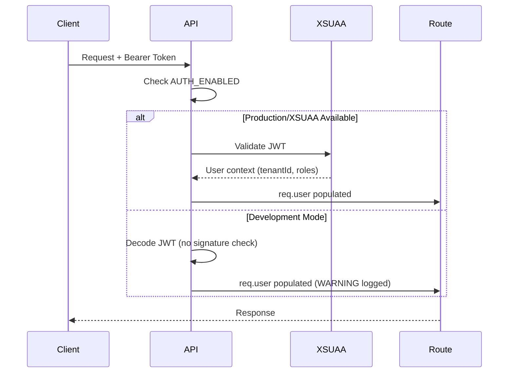

# Authentication & Rate Limiting Operations Guide

**Last Updated:** 2025-10-07
**Component:** API Layer
**Criticality:** HIGH (Production Blocker)

---

## Overview

This document describes the authentication and rate limiting systems implemented in the SAP MVP Framework API layer. These are **critical security controls** that must be properly configured before production deployment.

---

## Authentication

### Architecture

The framework supports two authentication modes:

1. **Production Mode (XSUAA):** Uses SAP BTP XSUAA service for JWT validation
2. **Development Mode:** Simple JWT decoding without signature validation

**Configuration:**
- Controlled by `AUTH_ENABLED` environment variable
- Default: `true` (authentication required)
- **Never set to `false` in production**

### How It Works



### Endpoints Security Model

| **Endpoint** | **Auth Required** | **Role Required** | **Rate Limit** |
|--------------|-------------------|-------------------|----------------|
| `/api/health` | ❌ No | None | None |
| `/api/version` | ❌ No | None | None |
| `/api/onboarding` | ✅ Yes | None | 100/min (authenticated) |
| `/api/admin/*` | ✅ Yes | `admin` | 50/hour |
| `/api/admin/tenants/:id/discover` | ✅ Yes | `admin` | 5/hour |
| `/api/modules/sod/analyze` | ✅ Yes | None | 10/hour |
| All other `/api/*` | ✅ Yes | None | 100/min (authenticated) |

### Configuration

**Environment Variables:**
```bash
# Enable authentication (default: true)
AUTH_ENABLED=true

# XSUAA Configuration (for SAP BTP)
XSUAA_URL=https://your-subdomain.authentication.sap.hana.ondemand.com
XSUAA_CLIENT_ID=your-client-id
XSUAA_CLIENT_SECRET=your-client-secret

# JWT Secret (for development mode only)
JWT_SECRET=your-dev-secret-key
```

**IMPORTANT:** In production, XSUAA credentials are provided automatically via BTP service binding. You do NOT need to set these manually.

### Testing Authentication

**Get a test JWT (development mode):**
```bash
# Simple JWT for testing (expires in 1 hour)
jwt="eyJhbGciOiJIUzI1NiIsInR5cCI6IkpXVCJ9.eyJzdWIiOiJ0ZXN0LXVzZXIiLCJlbWFpbCI6InRlc3RAdGVzdC5jb20iLCJyb2xlcyI6WyJ1c2VyIl0sInRlbmFudElkIjoidGVzdC10ZW5hbnQiLCJpYXQiOjE1MTYyMzkwMjIsImV4cCI6OTk5OTk5OTk5OX0.xxxxx"

# Make authenticated request
curl -H "Authorization: Bearer $jwt" \
  http://localhost:3000/api/onboarding
```

**Test XSUAA in production:**
```bash
# Login to BTP and get real token
cf login
cf oauth-token

# Use real token
curl -H "Authorization: Bearer $(cf oauth-token | tail -1)" \
  https://your-api.cfapps.sap.hana.ondemand.com/api/onboarding
```

### Troubleshooting

#### "Missing or invalid authorization token"
- **Cause:** No `Authorization` header or incorrect format
- **Fix:** Include `Authorization: Bearer <token>` header

#### "Invalid token"
- **Cause:** Token signature invalid (XSUAA mode) or malformed
- **Fix:** Get a fresh token from XSUAA/IAS

#### "Token expired"
- **Cause:** JWT `exp` claim is in the past
- **Fix:** Refresh token or get new one

#### "Authentication is DISABLED" warning in logs
- **Cause:** `AUTH_ENABLED=false` in environment
- **Fix:** Set `AUTH_ENABLED=true` (critical for production!)

---

## Rate Limiting

### Architecture

The framework implements **tenant-aware, role-based rate limiting** with Redis backend (falls back to in-memory for development).

**Key Features:**
- Isolation by tenant + user
- Tiered limits based on user role
- Stricter limits for expensive operations
- Graceful degradation if Redis unavailable

### Rate Limit Tiers

| **User Type** | **General API** | **Admin Operations** | **Service Discovery** | **SoD Analysis** |
|---------------|-----------------|----------------------|-----------------------|------------------|
| **Public (no auth)** | 10 req/min | N/A | N/A | N/A |
| **Authenticated** | 100 req/min | N/A | N/A | 10 req/hour |
| **Admin** | 1000 req/min | 50 req/hour | 5 req/hour | 10 req/hour |

**Rate Limit Key Format:**
```
rl:{tenantId}:{userId}       # General API
rl:discovery:{tenantId}      # Discovery (by tenant only)
rl:sod:{tenantId}            # SoD analysis (by tenant only)
rl:admin:{tenantId}:{userId} # Admin operations
```

### Configuration

**Environment Variables:**
```bash
# Redis URL for rate limiting (optional in dev, required in prod)
REDIS_URL=redis://:password@localhost:6379

# If not set, uses in-memory store (NOT for production)
```

**Docker Compose (local dev):**
```yaml
services:
  redis:
    image: redis:7-alpine
    ports:
      - "6379:6379"
    command: redis-server --requirepass redis123
```

### Response Headers

When rate limited, clients receive:
```
HTTP/1.1 429 Too Many Requests
RateLimit-Limit: 100
RateLimit-Remaining: 0
RateLimit-Reset: 1696700000
Retry-After: 60

{
  "error": "Too many requests",
  "message": "You have exceeded the rate limit. Please try again later.",
  "retryAfter": 60
}
```

**Standard Headers:**
- `RateLimit-Limit`: Max requests allowed in window
- `RateLimit-Remaining`: Requests remaining in current window
- `RateLimit-Reset`: Unix timestamp when limit resets
- `Retry-After`: Seconds to wait before retrying

### Testing Rate Limits

**Test general rate limit (10/min for unauthenticated):**
```bash
for i in {1..11}; do
  echo "Request $i:"
  curl -w "%{http_code}\n" http://localhost:3000/api/onboarding
done

# Requests 1-10 should return 200 or 401 (auth error)
# Request 11 should return 429 (rate limited)
```

**Test discovery rate limit (5/hour):**
```bash
TOKEN="your-jwt-token"
for i in {1..6}; do
  echo "Discovery $i:"
  curl -w "%{http_code}\n" \
    -H "Authorization: Bearer $TOKEN" \
    -X POST \
    http://localhost:3000/api/admin/tenants/test-tenant/discover
done

# Requests 1-5 should succeed
# Request 6 should return 429
```

### Monitoring

**Check Redis key space:**
```bash
redis-cli
> KEYS rl:*
> TTL rl:api:tenant1:user1
> GET rl:api:tenant1:user1
```

**View rate limit metrics (logs):**
```bash
# Look for rate limit warnings
cf logs sap-framework-api | grep "Rate limit exceeded"
```

**Prometheus metrics (if integrated):**
```promql
# Rate limit hits by tenant
rate_limit_exceeded_total{tenant_id="tenant1"}

# Requests remaining for tenant
rate_limit_remaining{tenant_id="tenant1", user_id="user1"}
```

### Troubleshooting

#### "Redis connection failed" in logs
- **Cause:** Redis not available
- **Impact:** Falls back to in-memory rate limiting (NOT multi-instance safe)
- **Fix:** Start Redis or configure `REDIS_URL`

#### Rate limits inconsistent across instances
- **Cause:** In-memory store being used (no Redis)
- **Fix:** Configure shared Redis instance

#### Legitimate user being rate limited
- **Cause:** User making too many requests
- **Options:**
  1. Ask user to slow down
  2. Increase quota for specific tenant (requires code change)
  3. Grant admin role (if appropriate)

#### Discovery rate limit too restrictive
- **Cause:** Tenant running discovery more than 5 times/hour
- **Options:**
  1. Explain rate limit purpose (prevent abuse)
  2. Temporarily increase limit in code for specific tenant
  3. Schedule discoveries instead of on-demand

---

## Operations

### Enabling/Disabling Auth (Emergency)

**NEVER disable auth in production.** If you must (e.g., debugging):

```bash
# Set environment variable
cf set-env sap-framework-api AUTH_ENABLED false
cf restage sap-framework-api

# Verify
curl http://your-api/api/onboarding
# Should return warning in logs but allow request

# RE-ENABLE IMMEDIATELY
cf set-env sap-framework-api AUTH_ENABLED true
cf restage sap-framework-api
```

### Adjusting Rate Limits

Rate limits are defined in `packages/api/src/middleware/rateLimiting.ts`.

**To increase discovery limit from 5/hour to 10/hour:**

```typescript
export const discoveryLimiter = rateLimit({
  // ...
  windowMs: 60 * 60 * 1000, // 1 hour
  max: 10, // <-- Change from 5 to 10
  // ...
});
```

**Deploy change:**
```bash
git commit -m "fix: increase discovery rate limit to 10/hour"
git push
# Trigger deployment via CI/CD or manual push to BTP
```

### Bypassing Rate Limits (Emergency)

**Option 1: Flush Redis keys**
```bash
redis-cli
> DEL rl:discovery:tenant1
> DEL rl:sod:tenant1
```

**Option 2: Temporarily increase limit**
See "Adjusting Rate Limits" above.

**Option 3: Grant admin role**
Admin users have 1000 req/min general quota.

---

## Security Considerations

### Auth

1. **Token Expiration:** Tokens expire after configured TTL (default: 1 hour for XSUAA)
2. **Token Refresh:** Client must refresh tokens before expiration
3. **Tenant Isolation:** `tenantId` claim in JWT ensures data isolation
4. **Role Verification:** Admin endpoints check for `admin` role in JWT claims

### Rate Limiting

1. **DDoS Protection:** Rate limiting is first line of defense against abuse
2. **Tenant Fairness:** Per-tenant limits prevent one tenant monopolizing resources
3. **Cost Control:** Expensive operations (discovery, SoD) have stricter limits
4. **Bypass Prevention:** Rate limiting applied BEFORE auth (prevents auth bypass attempts)

### Logging

All auth and rate limit events are logged with:
- `requestId`: Unique request identifier
- `tenantId`: Tenant making request
- `userId`: User making request
- `path`: API endpoint accessed
- `retryAfter`: Seconds to wait (rate limit events)

**Example log:**
```json
{
  "level": "warn",
  "message": "Rate limit exceeded",
  "tenantId": "acme-corp",
  "userId": "user@acme.com",
  "path": "/api/admin/tenants/acme-corp/discover",
  "retryAfter": 3600,
  "timestamp": "2025-10-07T12:34:56.789Z"
}
```

---

## Compliance

### GDPR

Rate limiting logs may contain PII (userId, email). Ensure:
- Logs retained per data retention policy (default: 90 days)
- PII masked in non-production environments
- Log access restricted to authorized personnel

### SOC 2

Rate limiting demonstrates:
- **Availability:** Protection against resource exhaustion
- **Confidentiality:** Prevents brute-force token guessing
- **Processing Integrity:** Fair allocation of resources

### ISO 27001

Auth and rate limiting support:
- **A.9.2.1:** User registration and de-registration
- **A.9.4.1:** Information access restriction
- **A.14.2.5:** Secure system engineering principles

---

## References

- [ARCHITECTURE.md](../00_audit/ARCHITECTURE.md) - System architecture
- [CONSOLIDATION_PLAN.md](../00_audit/CONSOLIDATION_PLAN.md) - PR strategy
- [ADR-0002](../adr/ADR-0002-auth-enforcement.md) - Auth enforcement decision (TODO)
- [ADR-0003](../adr/ADR-0003-rate-limiting.md) - Rate limiting design (TODO)
